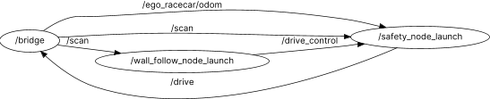

# How To Run ##

1. Clone the repo to sim_ws/src folder.
2. Source ros file
3. Run `colcon build` to build all models. As we used c++ node in our implementation, first time to build might take longer.
4. Source the install file by executing `source install/setup.bash`.
5. Run `ros2 launch milestones milestone1_py.py`. All nodes should be online.

# Algorithm Explanation #

## Overview ##

The end-to-end data and command path is:

1. **LiDAR input**: `wall_follow/data_process.py` subscribes to `/scan`, sanitizes ranges, and estimates left/right wall distance and tangent angle.
2. **Geometry smoothing**: left/right angles and distances are each smoothed with a 1D Kalman filter.
3. **PID control**: `wall_follow/PID_control.py` consumes the filtered geometry to compute the steering command.
4. **Command smoothing**: the steering command is filtered again via `kf_steering`.
5. **Control submission**: a `DriveControlMessage` (priority + drive command) is published.
6. **Safety**: `safety_node` keeps the latest message per priority in an ordered map and publishes the highest-priority command when AEB is inactive. And set speed to 0 when it is active. For compatibility reasons this node is also referred as drive control in this project.

## Data Processing ##

### LiDAR Data ###

The LiDAR scan was converted to a NumPy array and each beam angle was computed from the scan metadata:

$$
\theta_i = \theta_{\min} + i \cdot \Delta \theta
$$

Invalid readings were sanitized by replacing NaN and $\pm\infty$ with the sensor's minimum/maximum ranges. To keep computation bounded, the callback rate was capped at roughly 40 Hz.

The scan was split into left and right sectors using the indices corresponding to $0$ and $\pm \frac{\pi}{2}$ radians. For each side, a local wall segment was extracted by finding the minimum range index and taking a fixed window of samples around it. Those samples were converted to Cartesian coordinates:

$$
x = r \cos(\theta), \quad y = r \sin(\theta)
$$

A line was fit with least squares to estimate the wall tangent:

$$
y = m x + c
$$

From this line, the perpendicular distance to the wall and the tangent angle were computed:

$$
d = \frac{|c|}{\sqrt{m^2 + 1}}, \quad \alpha = \tan^{-1}(m)
$$

If the fit was ill-conditioned or had too few points, the algorithm fell back to the nearest range value and a zero angle. Finally, the left/right distances and angles were smoothed with independent Kalman filters (see Kalman Filter section below) before being passed to the controller.

### Kalman Filter ###

A simple 1D Kalman filter was used to smooth the estimated wall angles, distances, and steering command. The model assumes a constant state:

$$
x_k = x_{k-1}
$$

with measurement

$$
z_k = x_k + v_k
$$

and process noise. The predict step is

$$
\hat{x}_{k|k-1} = \hat{x}_{k-1}, \quad P_{k|k-1} = P_{k-1} + Q
$$

The update step uses the Kalman gain

$$
K_k = \frac{P_{k|k-1}}{P_{k|k-1} + R}
$$

to correct the state:

$$
\hat{x}_k = \hat{x}_{k|k-1} + K_k (z_k - \hat{x}_{k|k-1}), \quad
P_k = (1 - K_k) P_{k|k-1}
$$

Larger $R$ increases smoothing by trusting measurements less, while larger $Q$ makes the filter respond faster. 

In the processing pipeline, raw LiDAR geometry estimates are filtered first (left/right angles and distances), then the PID controller runs on those filtered values. The resulting steering command is filtered again before being published.

## PID Control ##

The angle and distance difference were used between two lasers to find the orientation of the car relative to the wall. The formulae used were

$$
\alpha = \tan^{-1}\left(\frac{a\sin(\theta)-b}{a\cos(\theta)}\right)
$$

$$
CD = b\cos(\alpha)
$$

Using the distance from the wall on both sides (named CD in the above equation), y was calculated by subtracting the distances on both sides of the car.

$$
y = \mathrm{dist}_{\text{left}} - \mathrm{dist}_{\text{right}}
$$

We also calculated the average angle for steering to using the left and right tangent to get an accurate read on steering angle

$$
\Theta = \frac{\theta_L + \theta_R}{2}
$$

The total error formula was given as follows

$$
\Theta = -(y + L \cdot \sin(\alpha))
$$

where L is a chosen distance in front of the car. We selected 1.5m. The steering angle is set to $\Theta$

Next, PID was implemented keeping track of the previous error and storing inside self.previous_error. Our PID control mainly consists of a proportional to adjust and arrive to a desired setpoint as well as a deravitive control used to smooth out the observed oscillation as we settle to a desired setpoint. The change in error over time is given with the formula

$$
\frac{de(t)}{dt} = \frac{e(t) - e(t-\Delta t)}{\Delta t}
$$

due to noisy data coming from the LiDAR sensor, a low pass filter was applied to the signal to smooth out the data and prevent jitter during driving caused by the derivative term.

Finally, integral was implemented by constantly adding the error in each frame over time to self.integral. self.integral is capped at a maximum and minimum of +/- 1.0 to prevent overcorrection/integral windup after the car is in an error state. The integral term was very beneficial to settle to the setpoint quickly during straight lines after a corner.

## Speed Control ##

To make sure our car operates safely at high speeds, we introduce multiple speed levels in our implementation.

We give the car a high speed when it is not turning and slow it down when it needs to perform a sharp turn. This allows our car to be fast on straightaways and perform well during turns.

## Safety & Drive Control ##

The drive control (safety) node multiplexes drive commands using an ordered map keyed by priority and enforces Automatic Emergency Braking (AEB). Each controller publishes a `DriveControlMessage` with a priority and an `active` flag; the node stores the latest message per priority while active and publishes the highest-priority command when AEB is not active.

AEB is triggered from LiDAR and odometry. For each valid beam (finite and within the scan range), the node computes range rate:

$$
\dot{r} = v \cos(\theta)
$$

and estimates time-to-collision for approaching beams ($\dot{r} > 0$):

$$
TTC = \frac{r}{\dot{r}}
$$

If the minimum TTC across beams falls below the TTC threshold or the minimum range is below the distance threshold, AEB engages. While active, the node continuously republishes the most recent command with speed forced to zero (looped every 5 ms). Thresholds are configured via CLI flags `--aeb-ttc-threshold` (default 0.3 s) and `--aeb-minimum-distance` (default 0.5 m). AEB can also be toggled manually via console commands (`aeb_on`/`aeb_off`).

## Videos of Our Algorithm ##

1. [Overview](https://youtu.be/etvGP7EX9d0) : Shows how car runs in Spielberg map
2. [Sharp Turn](https://youtu.be/IwhlQQPrbYY) : Shows the ability to take a sharp turn
3. [90 Degree Turn]( https://youtu.be/qFoOQlBKXjI) : Shows the ability to take a 90 degrees turn
4. [Continuous Turning](https://youtu.be/BL7XuTzfbpo): Shows the ability to run on continuous turns
5. [AEB TTC](https://youtu.be/xTRx6OV5bOY) : Shows the ability of having safety feature

# Testing Strategies #

## Overview ##

To ensure a safe implementation that strictly avoids collisions, a bottom-up testing approach was adopted. This methodology prioritized the independent verification of critical safety components before full system integration. The testing pipeline consisted of three stages:

1. **Modular Verification**: Isolated testing of the `safety_node` and `wall_follow_node`.
2. **System Integration**: Full-scale stress testing in the simulation environment.
3. **Edge Case Validation**: Targeted scenarios to test system recovery and boundary conditions.

## Modular Testing ##

The system was decoupled to test and tune the safety and control modules independently, ensuring that failures could be isolated effectively.

### Safety Node Verification ###

The Automatic Emergency Braking (AEB) logic was verified through isolated collision tests. The vehicle was manually driven towards obstacles at varying velocity profiles to ensure the `safety_node` could intervene reliably.

* **TTC Tuning**: The Time to Collision (TTC) threshold was adjusted to ensure the car halted before impact without triggering false positives during aggressive maneuvering.
* **Minimum Distance**: A hard distance constraint was tuned to act as a failsafe for low-speed approaches.

### Wall Following Node Tuning ###

The control logic was tuned using a dedicated debug publisher that outputted internal control states (error terms, steering angles, and filtered LiDAR data).

* **Visualization**: PlotJuggler was utilized to visualize cross-track error and steering commands in real-time. This allowed for data-driven tuning of PID gains ($K_p, K_d, K_i$) and the evaluation of LiDAR filtering latency.
* **Algorithm Refinement**: The wall identification algorithm was stress-tested against noisy sensor data to ensure the estimated tangent angle remained stable during cornering.

## Integration & Robustness ##

Following modular verification, the components were integrated for full-scale reliability testing.

### Long-Duration Stress Test ###

The vehicle was deployed in the simulation for extended durations in both **clockwise** and **counter-clockwise** directions. The objective was to verify that the `safety_node` remained dormant during normal wall-following operation and only intervened when genuine collision risks were artificially introduced.

### Edge Case Validation ###

Specific scenarios were designed to test the controller's limits:

* **Acute Angle Recovery**: The vehicle was manually positioned at extreme angles relative to the wall to verify that the PID controller could recover a safe trajectory without overshooting into the opposite wall.
* **Zero-Velocity Initialization**: The vehicle was initialized from a standstill directly facing a wall to ensure the logic handled "immediate obstacle" scenarios safely without startup instabilities.

## Future Improvements ##

To further refine the testing methodology for future milestones, the following improvements are planned:

1. **Automated Regression Testing**: Implementation of scripts to automatically reset the simulation and run the vehicle for fixed durations ($N$ laps), logging collision events programmatically to eliminate observer bias.
2. **Multi-Environment Validation**: Extending the test suite to include different maps (e.g., Levine Hall, Spielberg) to ensure the wall-following logic generalizes to varying track geometries and corridor widths, rather than being overfitted to a single environment.
